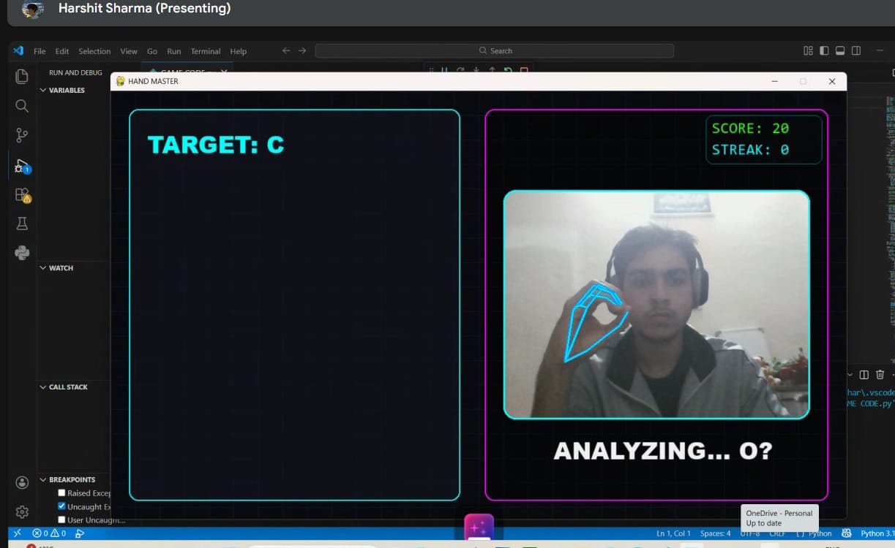

# **SignVise**

### *An Integrated ML‑Based Platform for Gesture‑Driven Text, Control & Safety with Gamified Learning*

---

## 🚨 **Problem Statement**
- Emergency situations often prevent manual device interaction  
- Existing systems lack automated gesture‑based detection  
- Absence of real‑time location and visual context delays response  
- Need for a low‑latency, hands‑free AI emergency alert mechanism  

---

## 💡 **Description & Solution**
- Real‑time hand landmark recognition powered by **Mediapipe**  
- Video frame processing & gesture duration tracking with **OpenCV**  
- Emergency alert system leveraging computer vision for sustained gesture detection  
- Automated SMS delivery via **Twilio API**, integrated with real‑time geolocation tracking  
- Gesture‑based cursor movement module designed for differently‑abled and bed‑ridden individuals  
- Gamified learning experience for gesture recognition to enhance accessibility and engagement  
- Built with **Python**, ensuring modularity, scalability, and cross‑platform adaptability  

---

## ⚙️ **Tech Stack**
- Python  
- Mediapipe  
- OpenCV  
- Twilio API  
- Geolocation Services  

---

## 🌍 **Impact**
- Enables hands‑free emergency response in critical situations  
- Provides assistive technology for differently‑abled users  
- Enhances learning and accessibility through gamified gesture recognition  

---

## 🎬 **Demonstration Video**
📥 [Download Demo Video](https://github.com/whisperinbinary/SignVise/raw/refs/heads/master/demo/Project%20SignVise%20Demo%20Video.mp4)

---

## 💼 **LinkedIn Post**
🔗 [View LinkedIn Update](https://www.linkedin.com/feed/update/urn:li:activity:7428827759898140672/)

---

## 📌 **Notes**
- This repository showcases the **concept, architecture, and workflow** of the project.  
- The complete source code is maintained privately in a separate repository to **protect originality and prevent plagiarism**.  
- Recruiters or collaborators may request access to review the implementation.  

---

## 👥 **Contributors**
- **Atal Sharma** – Project Lead & Backend Development (Chatbot & SOS Module)  
  [LinkedIn](https://www.linkedin.com/in/atal-sharma-2659aa370/)  

- **Harshit Sharma** – Backend Development (Text‑to‑Speech Module)  
  [LinkedIn](https://www.linkedin.com/in/harshit-sharma-4a167237b/)  

- **Abhishek Sharma** – Backend Development (Virtual Mouse Module)  
  [LinkedIn](https://www.linkedin.com/in/abhishek-sharma-765322370/)  

- **Pratyush Daspattnaik** – Frontend Development  
  [LinkedIn](https://www.linkedin.com/in/pratyush-daspattnaik-3b1a46366/)  

---

## 📷 **Project Visuals**

  
  
  

  
  

